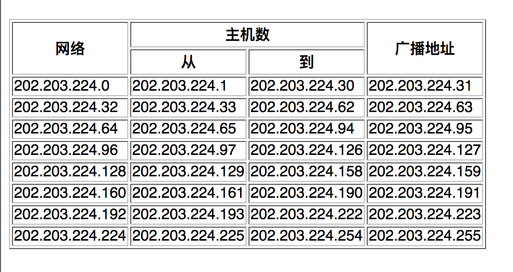

昨天面试（6.26），被喷得一塌糊涂，怀疑人生。又无法反驳，难受！自己确实菜，无话可说。但网络协议这块，确实需要一波总结了，每次别人一问就不知道从何说起。

__TCP/IP:__ Transmission Control Protocol/Internet Potocol，传输控制协议和网络协议，

1. 它定义了电子设备如何连入互联网，以及数据如何在它们之间传输的标准。

2. 它不是一个协议，而是一个协议族的统称，包括了IP协议、TCP协议、、、、、、等等。

3. 网络协议结构，四层：

   3.1 __应用层__：应用程序通过这一层访问网络，常见FTP、HTTP、DNS 和TELNET协议

   3.2 __传输层__：TCP 和 UDP 协议

   3.3 __网络层__：IP协议，ARP、RARP协议，ICMP协议

   3.4 __链路层（网络层接口）__： 是TCP/IP协议的基层，负责数据帧的发送和接收。

   ​

马丹，还要学[预备知识](https://github.com/buyDream/netPro/blob/master/%E7%BD%91%E7%BB%9C%E5%8D%8F%E8%AE%AE%E9%A2%84%E5%A4%87%E7%9F%A5%E8%AF%86.md)，虽然确实都知道，但是不能聊起来，尴尬。

---

+ ### 链路层

  从预备知识了解到，网络层协议的数据单元是IP数据报，链路层是帧。

  链路层的作用是将IP数据报封装成__帧__发到链路上，或把链路接收到的帧中的数据部分取出并交给网络层（逆向）。

  __功能__:

  * 将数据封装成帧（frame）
  * 控制帧的传输，包括处理传输差错，调节发送速率与接收方相匹配。
  * 在两个网络实体之间提供数据链路通路的建立、维持和释放的管理。

---

#### 	控制帧的传输

​		1. 差错控制

​		__反馈重发__:接收方检查差错编码（奇偶校验或CRC），发送方仅当接收到接收方正确接受的反馈信号后才能认为该帧已经正确发送，否则 需要重发至正确为止。

​		__计时器	__: 发送方主场，发送帧的时候启动计时器，超过限定时间后，则认为发送失败，重新发送。

​		__序号__:  	由于各种情况会导致同一帧重复发送多次，对每一帧编一个序号，方便接收方区分是新发送的还是重发的。（再发送到网络层）

#### 	流量控制

​		实际上是对发送数据流量的控制，类似IO，是发送速率（CPU）的不超过接收方（磁盘）速率。

---

#### 	以太网

​		一个标准，定义了CSMA/CD的接入方法。而IEEE802提供了另一个。导致数据帧的封装格式也不同。

---

#### SLIP协议

Serial Line IP（串行线路IP），对IP数据报进行封装。

规则：以END开头结尾，如果数据报中包含END或ESC，使用对应的连续替换。

缺陷：

+ 无法将本端IP地址传给对端
+ 当串行线路使用SLIP时，不能使用其他协议
+ 无法检查错误，只能依靠上层协议

#### PPP(点对点协议)

​	通过 拨号或专线 建立点对点连接发送数据，使各种主机、网桥和路由器之间简单连接。

。PPP修改了SLIP中的缺陷，并更换了规则。

#### MTU

最大传输单元，从[预备知识](https://github.com/buyDream/netPro/blob/master/%E7%BD%91%E7%BB%9C%E5%8D%8F%E8%AE%AE%E9%A2%84%E5%A4%87%E7%9F%A5%E8%AF%86.md)我们可以了解到以太网和IEEE802.3最大值分别是1500和1492.

如果网络层传下来的IP数据报长度比MTU大，那么__网络层__层就需要对数据报进行分片。

使用netstat -in 可以查看网络接口的MTU。

---

+ ### 网络层

  有IP、ARP、ICMP等协议。

  #### IP

  IP协议是TCP/IP最核心的协议，所有的TCP、UDP、ICMP及IGMP数据都以IP数据报格式传输。

  __IP协议提供的是不可靠、无连接的数据报传输服务__。

  不可靠：不能脖子数据报能成功到达目的地，它仅提供传输服务。可靠性由上层协议提供。

  无连接：IP协议对每个数据报的处理都是相互独立的。就是IP数据报可以不按发送顺序接收。

  ##### IP数据报

  普通IP数据报的报头长20字节，特殊如安全、军事领域会多个“选项”（可变长、可选信息）

##### 	IP地址分类

​	由网络号和主机号两部分组成。

​	分为ABCDE五类，网络规模	由大到小。

​	IP地址用32位二进制表示时，A、B、C类IP的网络号长度分别为8 、16 、 24位。

​	范围：A(1.0.0.0 — 127.0.0.0)、B(128.0.0.0 — 191.255.0.0)、C（192.0.0.0 — 223.255.255.0）

##### 	子网划分

​	IP地址如果只使用ABCDE划分，会造成浪费。因此在前者基础上，占用主机号前几位，用于表示子网号。

​	此时  IP = 网络号 + 子网号 + 主机号

​	用子网掩码来确定IP地址那几位是主机号，将IP地址和子网掩码进行__逻辑与__运算，结果就是子网号，进而可计算主机号。	

​	e.g.：

子网划分：两个C类网，202.203.204.0和202.203.224.0，分别把他们平均分成4个和八个子网，写出每个子网的起始终止IP和子掩码。

##### __4个：2^2，两位__

子网号 + 主机号 = 11000000 ~ 192

子网掩码：255.255.255.192              或/26

          

##### __8个，三位__

子网号 + 主机号 = 11100000 ~ 224

子网掩码：255.255.255.224

##### 	IP路由选择

​	解决发送方如何正确找到接收方的位置问题。

​	1 .如果两者直接连接（点对点）或在一个共享网络上（以太网），那么可以直接送达。（为什么?）

​	2 .一般情况是两者之间隔着多个路由器，需要多次转发：

* + * 搜索路由表，如果能找到和目的IP地址完全一致的主机，则将数据报发向该主机；
    * 未找到，再找同子网的路由器，发送
    * 又未找到，就搜索默认路由，存在就发报
    * 否则就丢掉这个报
    * 接收到数据报的路由器再走一遍上述流程，知道发送到目的主句
    * __注意__：如果在转发途中，IP数据报TTL已经被减为0，则抛弃这个报

##### 	NAT技术

当使用ifonfig查看IP时，会发现是这样：192.168.X.X 或172.16.X.X，这是C类网和B类网的私有地址，俗称内网IP。

Network Address Translation（网络地址转换），将内网IP转换为全球IP然后与英特网连接。

实现了宽带__共享__，缓解IP地址枯竭的问题（2011.2.3日分配完毕）。

##### 	IPv6

​	地址长度是128位，如：2000:0000:0000:0001:2345:6789:abcd。

---

#### ARP（Address Resolution Protocol）地址解析协议

作用：通过数据帧（链路层）的报头查询目标主机的MAC地址。

