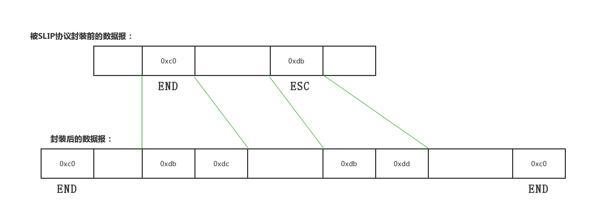

昨天面试（6.26），被喷得一塌糊涂，怀疑人生。又无法反驳，难受！自己确实菜，无话可说。但网络协议这块，确实需要一波总结了，每次别人一问就不知道从何说起。

__TCP/IP:__ Transmission Control Protocol/Internet Potocol，传输控制协议和网络协议，

1. 它定义了电子设备如何连入互联网，以及数据如何在它们之间传输的标准。

2. 它不是一个协议，而是一个协议族的统称，包括了IP协议、TCP协议、、、、、、等等。

3. 网络协议结构，四层：

   3.1 __应用层__：应用程序通过这一层访问网络，常见FTP、HTTP、DNS 和TELNET协议

   3.2 __传输层__：TCP 和 UDP 协议

   3.3 __网络层__：IP协议，ARP、RARP协议，ICMP协议

   3.4 __链路层（网络层接口）__： 是TCP/IP协议的基层，负责数据帧的发送和接收。

   ​

马丹，还要学[预备知识](https://github.com/buyDream/netPro/blob/master/%E7%BD%91%E7%BB%9C%E5%8D%8F%E8%AE%AE%E9%A2%84%E5%A4%87%E7%9F%A5%E8%AF%86.md)，虽然确实都知道，但是不能聊起来，尴尬。

---

+ ### 链路层

  从预备知识了解到，网络层协议的数据单元是IP数据报，链路层是帧。

  链路层的作用是将IP数据报封装成__帧__发到链路上，或把链路接收到的帧中的数据部分取出并交给网络层（逆向）。

  __功能__:

  * 将数据封装成帧（frame）
  * 控制帧的传输，包括处理传输差错，调节发送速率与接收方相匹配。
  * 在两个网络实体之间提供数据链路通路的建立、维持和释放的管理。

---

#### 	控制帧的传输

​		1. 差错控制

​		__反馈重发__:接收方检查差错编码（奇偶校验或CRC），发送方仅当接收到接收方正确接受的反馈信号后才能认为该帧已经正确发送，否则 需要重发至正确为止。

​		__计时器	__: 发送方主场，发送帧的时候启动计时器，超过限定时间后，则认为发送失败，重新发送。

​		__序号__:  	由于各种情况会导致同一帧重复发送多次，对每一帧编一个序号，方便接收方区分是新发送的还是重发的。（再发送到网络层）

#### 	流量控制

​		实际上是对发送数据流量的控制，类似IO，是发送速率（CPU）的不超过接收方（磁盘）速率。

---

#### 	以太网

​		一个标准，定义了CSMA/CD的接入方法。而IEEE802提供了另一个。导致数据帧的封装格式也不同。

---

#### SLIP协议

Serial Line IP（串行线路IP），对IP数据报进行封装。

规则：以END开头结尾，如果数据报中包含END或ESC，使用对应的连续替换。

缺陷：

+ 无法将本端IP地址传给对端
+ 当串行线路使用SLIP时，不能使用其他协议
+ 无法检查错误，只能依靠上层协议

#### PPP(点对点协议)

​	通过 拨号或专线 建立点对点连接发送数据，使各种主机、网桥和路由器之间简单连接。

。PPP修改了SLIP中的缺陷，并更换了规则。

#### MTU

最大传输单元，从[预备知识](https://github.com/buyDream/netPro/blob/master/%E7%BD%91%E7%BB%9C%E5%8D%8F%E8%AE%AE%E9%A2%84%E5%A4%87%E7%9F%A5%E8%AF%86.md)我们可以了解到以太网和IEEE802.3最大值分别是1500和1492.

如果网络层传下来的IP数据报长度比MTU大，那么__网络层__层就需要对数据报进行分片。

使用__netstat -in__ 可以查看网络接口的MTU。

---

+ ### 网络层

  有IP、ARP、ICMP等协议。

  #### IP

  IP协议是TCP/IP最核心的协议，所有的TCP、UDP、ICMP及IGMP数据都以IP数据报格式传输。

  __IP协议提供的是不可靠、无连接的数据报传输服务__。

  不可靠：不能保证数据报能成功到达目的地，它仅提供传输服务。可靠性由上层协议提供。

  无连接：IP协议对每个数据报的处理都是相互独立的。就是IP数据报可以不按发送顺序接收。

  ##### IP数据报

  普通IP数据报的报头长20字节，特殊如安全、军事领域会多个“选项”（可变长、可选信息）

##### 	IP地址分类

​	由网络号和主机号两部分组成。

​	分为ABCDE五类，网络规模	由大到小。

​	IP地址用32位二进制表示时，A、B、C类IP的网络号长度分别为8 、16 、 24位。

​	范围：A(1.0.0.0 — 127.0.0.0)、B(128.0.0.0 — 191.255.0.0)、C（192.0.0.0 — 223.255.255.0）

##### 	子网划分

​	IP地址如果只使用ABCDE划分，会造成浪费。因此在前者基础上，占用主机号前几位，用于表示子网号。

​	此时  IP = 网络号 + 子网号 + 主机号

​	用子网掩码来确定IP地址那几位是主机号，将IP地址和子网掩码进行__逻辑与__运算，结果就是子网号，进而可计算主机号。	

​	e.g.：

子网划分：两个C类网，202.203.204.0和202.203.224.0，分别把他们平均分成4个和八个子网，写出每个子网的起始终止IP和子掩码。

##### __4个：2^2，两位__

子网号 + 主机号 = 11000000 ~ 192

子网掩码：255.255.255.192              或/26

          

##### __8个，三位__

子网号 + 主机号 = 11100000 ~ 224

子网掩码：255.255.255.224

##### 	IP路由选择

​	解决发送方如何正确找到接收方的位置问题。

​	1 .如果两者直接连接（点对点）或在一个共享网络上（以太网），那么可以直接送达。（为什么?）

​	2 .一般情况是两者之间隔着多个路由器，需要多次转发：

* + * 搜索路由表，如果能找到和目的IP地址完全一致的主机，则将数据报发向该主机；
    * 未找到，再找同子网的路由器，发送
    * 又未找到，就搜索默认路由，存在就发报
    * 否则就丢掉这个报
    * 接收到数据报的路由器再走一遍上述流程，直到发送到目的主句
    * __注意__：如果在转发途中，IP数据报TTL已经被减为0，则抛弃这个报

##### 	NAT技术

当使用ifonfig查看IP时，会发现是这样：192.168.X.X 或172.16.X.X，这是C类网和B类网的私有地址，俗称内网IP。

Network Address Translation（网络地址转换），将内网IP转换为全球IP然后与英特网连接。

实现了宽带__共享__，缓解IP地址枯竭的问题（2011.2.3日分配完毕）。

##### 	IPv6

​	地址长度是128位，如：2000:0000:0000:0001:2345:6789:abcd。

---

#### ARP（Address Resolution Protocol）地址解析协议

作用：通过数据帧（链路层）的报头查询目标主机的MAC地址。

通过命令 **arp -a** 查看 ARP 缓存表(表项记录 20 分钟超时)

#### RARP逆向地址解析协议

#### ICMP控制报文协议：

​	用于反馈通信过程中出现的问题，通过这些反馈信息对问题进行诊断。

##### 	常用工具

​		ping 和 traceroute , 后接IP地址或域名。、

#### IGMP组管协议

---

---

* ### 传输层

  从网络层看，通信的是两台主机（IP数据报就包含了两台主机的IP地址）

  该层下分UDP和TCP，不同的应用进程在传输层中使用其一。

  除电子邮件（SMTP）、远程终端接入（TELNET）、万维网（http/https）、文件传送（FTP）外，基本都是UDP。

  ​

  |       |                UDP                 |                  TCP                   |
  | :---: | :--------------------------------: | :------------------------------------: |
  |       | 无连接，不需要建立连接，支持一对多、一对一、多对一和多对多的交互通信 |    点对点连接，一条TCO智能连接两个端点，连接三次握手、断开四次     |
  |       | 面向报文，只对网络层下来的数据进行简单的封装（添加8字节的UDP头） |           面向字节流，把数据看作一连串字节序号           |
  |       |              额，这个。。。               |    提供双工通信，允许双方任何时候发生数据（两端都有接收和发送缓存）    |
  |       |           不可靠，但是尽最大努力交付            |            可靠的，无差错、不重复、按顺序             |
  |       |    没有拥塞控制，允许丢包，如视屏语音等，防止出现延时积累     |               有流量控制和拥塞控制               |
  |  报文   |           报头（8字节） + 数据部分           | 报头（20字节固定长度 + 4n字节的选项（最长达40字节）） + 数据部分 |
  | 应用层协议 |             DNS、TFTP等              |               http、FTP等                |

  ​

  ---

  ##### TCP三次握手建立连接

  1. 客户端发送请求报文，自身进入SYN-SENT（同步已发送）状态
  2. 服务端接收到请求报文后，向客户端发送确认报文，服务端进入SYN_RCVD（同步收到）状态
  3. 客户端收到服务端的确认报文后，再向服务端发送一个确认报文。客户端进图ESTABLISHED（连接）状态，__这个报文已经可以携带数据了，不携带就不消耗序号__。

  此时TCP已经建立连接，当服务端收到确认后也进入ESTABLISHED状态。

  ##### 释放

  数据传输结束后，双方释放连接

  1. 客户端停止发送数据，并发送一个FIN=1报文段，客户端进入FIN-WAIT-1（终止等待1）状态；
  2. 服务端回复确认报文，服务端进入CLOSE-WAIT（关闭等待）状态。__此时TCP连接处于半开半闭状态__，服务端发送数据，客户端仍然会接收。
  3. 客户端确认报文，进入FIN_WAIT-2状态，服务端发送完数据后，发出FIN=1报文段，然后进入LAST-ACK（最后确认）状态。
  4. 客户端回复企鹅人报文，ACK= 1，然后进入TIME-WAIT（时间等待）状态。
  5. 此时连接仍未释放需要等待状态结束后（4分钟）才会真正进入CLOSED（状态）。设置等待是因为可能最后一个确认报文需要重传。

  ---

  ​

  #### 超时重传

  ​	是TCP可靠性的关键，只要没得到确认抱人，就重新发送数据，直到收到确认为止。

  ##### 注意：

  + 发送一个报文后，会__暂时保留__该报文段的副本，为发生超时重传时使用，收到确认即删除。
  + 确认报文也需要序号，来辨别到底是哪一个报文得到了确认
  + 超时解释器比传输往返时间略长，但具体时间不确定的，根据网络情况而变。

  ​

  #### 连续ARQ协议

  ​	不必每发一个报文就要等待一下确认。类似比较对象等同性（不必每个字段的比）。

  ​	1. 发送方可以连续发送多个报文（__流水线传输__）,接收方接收多个连续报文后，只回复确认最后一个报文，表示这之前的数据都已经收到。

  ---

  ### 

   $ sudo tcpdump -vvv -X -i lo tcp port 7777
  tcpdump: listening on lo, link-type EN10MB (Ethernet), capture size 262144 bytes
  21:37:38.842203 IP (tos 0x0, ttl 64, id 50597, offset 0, flags [DF], proto TCP (6), length 60)

    localhost.52196 > localhost.7777: Flags [S], cksum 0xfe30 (incorrect -> 0xb143), seq 3159206863, win 43690, options [mss 65495,sackOK,TS val 857632362 ecr 0,nop,wscale 7], length 0
    0x0000:  4500 003c c5a5 4000 4006 7714 7f00 0001  E..<..@.@.w.....
    0x0010:  7f00 0001 cbe4 1e61 bc4d abcf 0000 0000  .......a.M......
    0x0020:  a002 aaaa fe30 0000 0204 ffd7 0402 080a  .....0..........
    0x0030:  331e 6e6a 0000 0000 0103 0307            3.nj........
21:37:38.842218 IP (tos 0x0, ttl 64, id 0, offset 0, flags [DF], proto TCP (6), length 60)
    localhost.7777 > localhost.52196: Flags [S.], cksum 0xfe30 (incorrect -> 0xd479), seq 3342169082, ack 3159206864, win 43690, options [mss 65495,sackOK,TS val 857632362 ecr 857632362,nop,wscale 7], length 0
    0x0000:  4500 003c 0000 4000 4006 3cba 7f00 0001  E..<..@.@.<.....
    0x0010:  7f00 0001 1e61 cbe4 c735 73fa bc4d abd0  .....a...5s..M..
    0x0020:  a012 aaaa fe30 0000 0204 ffd7 0402 080a  .....0..........
    0x0030:  331e 6e6a 331e 6e6a 0103 0307            3.nj3.nj....
21:37:38.842231 IP (tos 0x0, ttl 64, id 50598, offset 0, flags [DF], proto TCP (6), length 52)
    localhost.52196 > localhost.7777: Flags [.], cksum 0xfe28 (incorrect -> 0xa6be), seq 1, ack 1, win 342, options [nop,nop,TS val 857632362 ecr 857632362], length 0
    0x0000:  4500 0034 c5a6 4000 4006 771b 7f00 0001  E..4..@.@.w.....
    0x0010:  7f00 0001 cbe4 1e61 bc4d abd0 c735 73fb  .......a.M...5s.
    0x0020:  8010 0156 fe28 0000 0101 080a 331e 6e6a  ...V.(......3.nj
    0x0030:  331e 6e6a                                3.nj
__三次握手结束__

21:39:22.116111 IP (tos 0x0, ttl 64, id 7569, offset 0, flags [DF], proto TCP (6), length 54)

    localhost.7777 > localhost.52196: Flags [P.], cksum 0xfe2a (incorrect -> 0xd96f), seq 1:3, ack 1, win 342, options [nop,nop,TS val 857658181 ecr 857632362], length 2
    0x0000:  4500 0036 1d91 4000 4006 1f2f 7f00 0001  E..6..@.@../....
    0x0010:  7f00 0001 1e61 cbe4 c735 73fb bc4d abd0  .....a...5s..M..
    0x0020:  8018 0156 fe2a 0000 0101 080a 331e d345  ...V.*......3..E
    0x0030:  331e 6e6a 6869                           3.njhi
21:39:22.121087 IP (tos 0x0, ttl 64, id 50599, offset 0, flags [DF], proto TCP (6), length 52)
    localhost.52196 > localhost.7777: Flags [.], cksum 0xfe28 (incorrect -> 0xdd04), seq 1, ack 3, win 342, options [nop,nop,TS val 857658182 ecr 857658181], length 0
    0x0000:  4500 0034 c5a7 4000 4006 771a 7f00 0001  E..4..@.@.w.....
    0x0010:  7f00 0001 cbe4 1e61 bc4d abd0 c735 73fd  .......a.M...5s.
    0x0020:  8010 0156 fe28 0000 0101 080a 331e d346  ...V.(......3..F
    0x0030:  331e d345                                3..E
21:39:38.866959 IP (tos 0x0, ttl 64, id 50600, offset 0, flags [DF], proto TCP (6), length 57)
    localhost.52196 > localhost.7777: Flags [P.], cksum 0xfe2d (incorrect -> 0x88cb), seq 1:6, ack 3, win 342, options [nop,nop,TS val 857662368 ecr 857658181], length 5
    0x0000:  4500 0039 c5a8 4000 4006 7714 7f00 0001  E..9..@.@.w.....
    0x0010:  7f00 0001 cbe4 1e61 bc4d abd0 c735 73fd  .......a.M...5s.
    0x0020:  8018 0156 fe2d 0000 0101 080a 331e e3a0  ...V.-......3...
    0x0030:  331e d345 6865 6c6c 6f                   3..Ehello
21:39:38.867048 IP (tos 0x0, ttl 64, id 7570, offset 0, flags [DF], proto TCP (6), length 52)
    localhost.7777 > localhost.52196: Flags [.], cksum 0xfe28 (incorrect -> 0xbc4a), seq 3, ack 6, win 342, options [nop,nop,TS val 857662368 ecr 857662368], length 0
    0x0000:  4500 0034 1d92 4000 4006 1f30 7f00 0001  E..4..@.@..0....
    0x0010:  7f00 0001 1e61 cbe4 c735 73fd bc4d abd5  .....a...5s..M..
    0x0020:  8010 0156 fe28 0000 0101 080a 331e e3a0  ...V.(......3...
    0x0030:  331e e3a0                                3...
^Z
[1]  + 343 suspended  sudo tcpdump -vvv -X -i lo tcp port 7777
shiyanlou:tcp_ip_6/ (master*) $                                      [21:40:15]

+ ### 应用层

  #### DNS：域名服务

  ​	基于UDP，端口号53。

  ​	DNS：域名与IP地址的对应关系

  ​	ARP：IP地址与MAC地址的对应关系

  ​

  域名解析，似图片展示，

  先查询DNS缓存，没有到host文件差，没有再请求DNS查。（缓存不用我们做）	

#### 	FTP: 文件传输

​		基于TCP，21号端口建立控制连接，20号端口建立数据连接。

#### 	HTTP：

​		基于TCP ，端口号80 或 8080

​		应用层HTTP报文经过传输层，变成TCP数据报，在经过网络层封装为IP数据报，然后帧。。。

​	

#### 	HTTPS：

​			HTTP + SSL，端口号443

​		需要加解密（传输加密，接收解密）