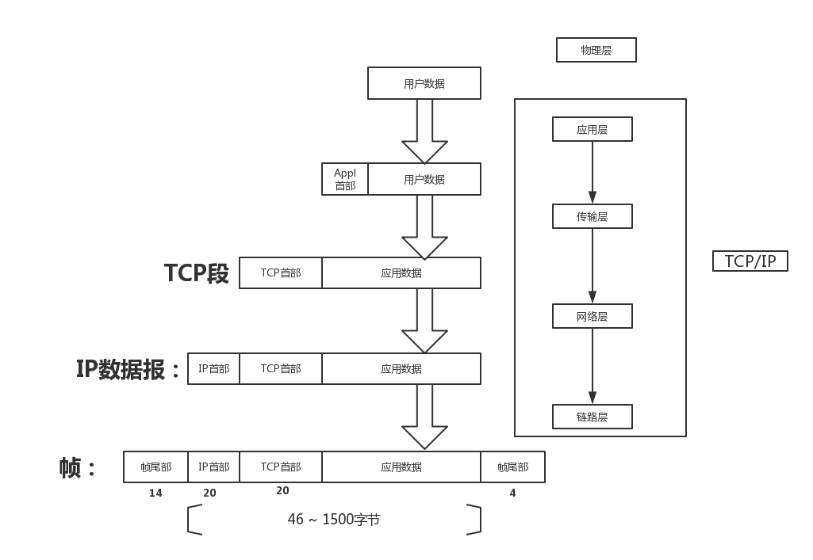

1. ### IP地址

   32bit，分成四组，如：255.255.255.255。Mac OS 使用

   ~~~shell
   $ifconfig
   ~~~

   查看。

   __在TCP/IP中由网络层管理。__因此每个网络位置会有一个专属IP地址。

2. ### 域名

   12位数字很难记，域名应运而生，即为IP地址的别名。

   域名和IP地址相对应，并把这种对应关系存储在__域名服务系统__DNS中；

   如www.eapm.tech，https://github.com/buyDream

   使用nslookup或者ping(按control + c退出)来查看与域名对应的IP

   ~~~shell
   # ping
   $ ping www.eapm.tech
   PING www.eapm.tech (139.59.120.59): 56 data bytes
   64 bytes from 139.59.120.59: icmp_seq=0 ttl=48 time=401.371 ms
   64 bytes from 139.59.120.59: icmp_seq=1 ttl=48 time=626.118 ms
   64 bytes from 139.59.120.59: icmp_seq=2 ttl=48 time=547.441 ms
   64 bytes from 139.59.120.59: icmp_seq=3 ttl=48 time=466.648 ms
   Request timeout for icmp_seq 4
   Request timeout for icmp_seq 5
   64 bytes from 139.59.120.59: icmp_seq=6 ttl=48 time=531.648 ms
   64 bytes from 139.59.120.59: icmp_seq=7 ttl=48 time=334.882 ms
   64 bytes from 139.59.120.59: icmp_seq=8 ttl=48 time=367.811 ms
   64 bytes from 139.59.120.59: icmp_seq=9 ttl=48 time=600.742 ms
   ^C
   --- www.eapm.tech ping statistics ---
   11 packets transmitted, 8 packets received, 27.3% packet loss
   round-trip min/avg/max/stddev = 334.882/484.583/626.118/101.847 ms

   # nslookup
   $ nslookup www.eapm.tech
   Server:		192.168.2.1
   Address:	192.168.2.1#53

   Non-authoritative answer:
   Name:	www.eapm.tech
   Address: 139.59.120.59
   ~~~

   ​

3. ### Mac地址

   Media Access Control地址缩写，或称为物理地址、硬件地址，用来定义互联网中设备的位置。

   __在TCP/IP中由链路层管理__，每个主机会有一个他的唯一MAC地址。

4. ### 端口号

   是为了找到对应通信应用程序，通过IP发现网络位置，再由端口号来识别不同的应用程序。

   #### 4.1 规则

   采用16位标识，故一个IP地址端口可以有2^16^ = 65536个。

   服务器的默认程序一般都是熟悉的端口号，如，SMTP 25，HTTP 80等（1 ~ 1024）。

   __编号0 ~ 1023__:系统端口号，www.iana.org可查

   __1024 ~ 4951：__登记端口号，需要到IANA注册，防重复。

   __41952 ~ 65535：__短暂端口号，供暂时使用。

5. ### 封装和分用

   #### 5.1 封装

   ​	当应用程序发送数据的时候，数据在协议层次当中从顶向下每通过一层，都会对数据增加一些首部和尾部信息，称之为协议数据单元（缩写PDU）。

   ​	在分层协议系统里，在制定的协议层上传送的数据单元，包含了该层的__协议控制信息__和__用户信息__。

   * + 物理层   PDU指数据位 （Bit）

     + 数据链路层  PDU 指数据帧 （Frame）

     + 网络层 PDU 指数据包 （Segment）

     + 用户数据 （data）

       

   #### 5.2 分用

   ​	与封装相反，从协议底层开始，每通过一层检查并去掉层级的报文头部或尾部。

6. ### RFC

   request for comment ： 是所有以太网协议的正式标准，并在其[官网](www.ietf.org)公布。

   这个还不知道干什么的，用到的时候再看。

### MAC地址与IP地址：

问题：既然有了IP地址，为什么还要有MAC地址？

​	首先，由ARP可知，ARP缓存表存的是IP得知和MAC地址的__对应关系__,

​	主机间通信，往往需要经过多次交换机。

​	若无MAC地址，则其经过的交换机会广播，每个网内的主机都会受到数据，而因为最终到网络层（IP），则会是除了目标主机（IP地址正确）外都将抛弃该数据。

​	再强调一点，交换机和路由器也有自己IP。